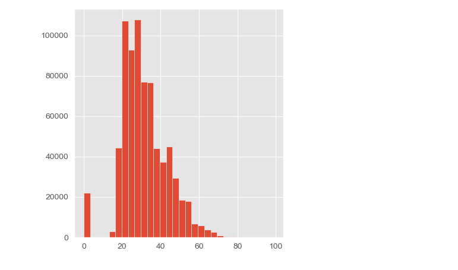
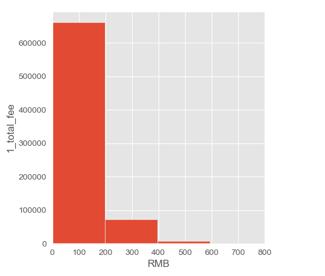
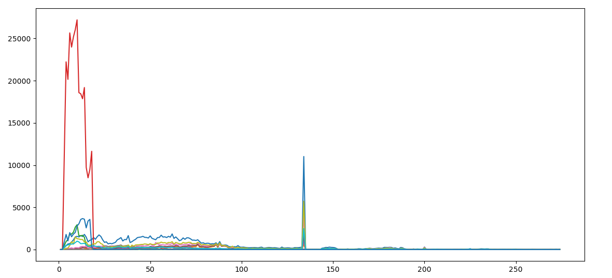
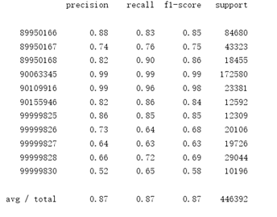
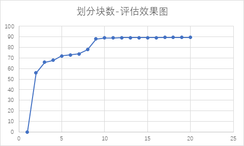
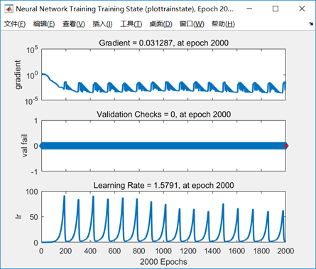
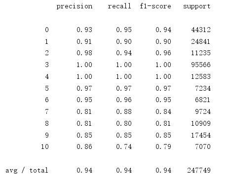

# 面向电信行业存量用户的智能套餐个性化匹配模型

**小组成员**：魏剑宇(PB17111586)、龚平(PB17030808)、黄业琦(PB17000144)

**学院**：计算机与技术学院、少年班学院

## 摘要

本次赛题的场景为电信套餐的个性化推荐。对数据进行了分析和处理。分析了各列数据的分布特征和对预测类型产生的可能影响，对缺失的数据进行了合理的预处理，并分析了各个数据间的相关性，对数据有了较深的了解。

之后经过决策树、神经网络等模型的尝试，对各个模型训练的结果进行了分析。最终采用了LightGBM。LightGBM是基于梯度上升决策树的一个框架。单独使用此框架就已能得到不错的成绩。

经过特殊数据的处理防止过拟合、单独二分类、参数调整等优化后，模型在初赛测试集上取得了不错的效果。

## 关键词

数据预处理、推荐系统、LightGBM、二分类

## 数据分析及预处理

### 问题场景

本次赛题的场景为电信套餐推荐，为了进一步了解背景并方便探索套餐类型的与数据的关系，调查了各个类型对应的实际套餐。如下所示

|current_service|对应实际套餐|
|:---:|:---:|
|99999826|4G全国套餐-196元套餐 |
|99999828|4G全国套餐-136元套餐 |
|89950166|4G全国套餐-76元套餐 |
|99999827|4G全国套餐-166元套餐 |
|89950167|4G全国套餐-106元套餐 |
|99999830|4G全国套餐-76元套餐 |
|90109916|蚂蚁大宝卡 |
|89950168|4G全国套餐-56元套餐 |
|99999825|4G全国套餐-296元套餐 |
|90155946|腾讯天王卡 |
|90063345|腾讯大王卡 |

### 数据预处理

初始数据情况如下

| columns | num  | null or non-null | type | description |
| :-----: | :--: | :--------------: | :--: | :---------: |
|service_type       |      743990| non-null |int64|套餐类型 0：23G融合，1：2I2C，    2：2G，3：3G，4：4G|
|is_mix_service      |      743990| non-null |int64|是否固移融合套餐 1.是 0.否|
|online_time         |      743990| non-null| int64|在网时长|
|1_total_fee         |      743990| non-null |float64|当月总出账金额|
|2_total_fee         |      743990| non-null| object|当月前1月总出账金额|
|3_total_fee         |      743990| non-null |object|当月前2月总出账金额|
|4_total_fee         |      743990| non-null |float64|当月前3月总出账金额|
|month_traffic       |      743990| non-null| float64|当月累计-流量（单位：MB）|
|many_over_bill      |      743990 |non-null| int64|连续超套|
|contract_type       |      743990 |non-null| int64|合约类型|
|contract_time       |      743990 |non-null| int64|合约时长|
|is_promise_low_consume|    743990| non-null| int64|是否承诺低消用户 1.是 0.否|
|net_service           	|    743990 |non-null| int64|网络口径用户|
|pay_times             	|    743990| non-null| int64|交费次数|
|pay_num                |  	 743990| non-null |float64|交费金额|
|last_month_traffic     |	   743990 |non-null| float64|上月结转流量|
|local_trafffic_month    |	  743990| non-null |float64|月累计-本地数据流量|
|local_caller_time       |	  743990| non-null |float64|本地语音主叫通话时长|
|gender               |   	  743990 |non-null |object|性别|
|age                     |	  743990| non-null| object|年龄|
|complaint_level     |  	   	 743990 |non-null| int64|投诉重要性|
|former_complaint_num  |  	  743990| non-null| int64|交费金历史投诉总量|
|former_complaint_fee  | 	   743990| non-null |float64|历史执行补救费用交费金额|
|current_service      	|     743990 |non-null| int64|**需要预测的套餐类型**|

官方提供的数据并不十分规整，csv中存在缺失值(\N)，主要在`total_fee`列中。由于训练集中缺失数据的行很少，只有几行，相对于总数据量**743990**行的影响很小，故直接去除。

对于测试集，由于缺失的数据主要在`total_fee`，而`total_fee`相关的列共有4列，`1_total_fee`,`2_total_fee`,`3_total_fee`,`4_total_fee`，且经过对数据特征的观察，其间的关联性很明显，故对于缺失的列直接填充其它完好列的平均值。

此外数据中还存在一些异常值0等，推测应该是未能统计到的数据。

### 数据分析

#### 定量统计

首先对几列定量数据进行分析，得到结果如下
| |online_time  |  1_total_fee   | 2_total_fee  |  3_total_fee |   4_total_fee|  month_traffic  |contract_time|
|---|--:|--:|--:|--:|--:|--:|--:|
|count  | 743990.000000 | 743990.000000|  743990.000000  |743990.000000 | 743990.000000 | 743990.000000  |743990.000000    |
|mean    |    42.163250  |   105.316648    | 111.153573   |  102.827366    | 110.909542    |1280.314131    |   7.769703  |
|std       |  45.526346  |    90.661524    |  98.551588  |    94.656646  |   102.790653    |2865.051949    |  10.348774  |
|min     |     1.000000     |  0.000000   | -287.300000 |   -276.030000   | -420.270000|       0.000000   |   -1.000000   |
|25%       |  10.000000  |    52.200000 |     54.500000  |    47.300000    |  51.600000 |      0.000000     |  0.000000|
|50%     |    17.000000  |    76.000000  |    80.000000   |   76.000000   |   78.400000 |    300.000000  |     0.000000   |
|75%      |   65.000000   |  127.450000   |  136.000000 |    129.000000    | 137.000000    |1535.362151   |   12.000000   |
|max    |    274.000000 |   5940.830000  |  5825.570000|    7242.010000   | 5141.270000  |159057.397800 |     52.000000  |

可以发现，1_total_fee, 2_total_fee, 3_total_fee, 4_total_fee 的平均值几乎相同。

#### 各个数据的分布情况

为方便对数据进行离散化，统计了数据的分布情况，绘制图表如下所示


1. **关于complaint_level**：由官网数据介绍我们可以知道1代表普通，2代表重要，3代表重大，而0应该是数据缺失未被标记。可见，只有少部分人被标记了complaint_level，并且在其中只有极少数是重要或者重大等级。
2. **关于gender**：1代表男性，2代表女性，0代表gender未被标记。在此处，我们可以发现，男女性对同一套餐的偏爱程度不同，其中89950167（即4G全国套餐-106元套餐）相较别的套餐更受男女性欢迎。
3. **关于is_promise_low_consume**：1代表是低保，0代表不是低保。可见绝大多数人都是非低保用户。低保用户的套餐多集中于89950166、89950167、99999828，其其套餐金额都在150元以下。这也符合现实常识。
4. **关于many_over_bil**l: 1代表是，0代表不是。虽然各个套餐都有超套的现象，但是钟意人生最多的89950168套餐超套现象格外严重，近百分之九十的89950168套餐都超套。
5. **关于service_type**：0代表23G融合，1代表2I2C，2代表2G，3代表3G，4代表4G。可见极大部分用户都是1或者4，没有0，2，几乎没有3。



**关于age分布**：0代表数据缺失，用户年龄分布呈现右偏分布，主要用户以20到40岁的青壮年为主，娱乐影音需求较强。



**关于1_total_fee分布**：1_total_fee，2_total_fee，3_total_fee，4_total_fee的分布都极其类似，在0-200元段集中了近百分之八十五的用户，费用超过400RMB的不足百分之五。



**关于online_time**：网时长的范围在1-274小时之间。上图横轴是在网时长，纵轴是人数，每种颜色的线代表一种套餐类型.

#### 自变量与因变量的关系

为了观察各个自变量与因变量的相关程度和线性关系，我们绘制了数据的矩阵热力图


如上图所示，绘制了各个变量之间的（线性）相关程度，大部分不存在很明显的线性关系，排除了共线性问题。

## 模型尝试与选择

在比赛的初期，我们先进行了各种模型的尝试，在对比的过程中进一步分析数据的特点。

### 决策树

本次预测是个典型的多分类问题，考虑到数据规模比较大且我们的设备性能较为孱弱，所以我们刚开始选择运行速度较快且准确率较高的决策树作为我们的第一个模型。核心代码如下

```python
# 数据预处理
# ——*——*——*——*——*——*——*——*——*——*——*——*——*——*——*——*——*——*——*——*
clf = tree.DecisionTreeClassifier(criterion='gini',
                                  splitter ='best',
                                  max_depth=100,
                                  min_samples_leaf=50,
                                  min_samples_split=20
                                  )
clf = clf.fit(x_train, y_train)
clf = clf.fit(x, y)

df_t = pd.read_csv("republish_test2.csv", low_memory=False)
x = df_t.loc[:, headers]
x = np.array(x)
y = clf.predict(x)

array = np.empty(shape=(200000, 2), dtype=object)
array[:, 0] = df_t.loc[:, 'user_id']
array[:, 1] = y
df = pd.DataFrame(data=array, columns=['user_id', 'current_service'])
df.to_csv("result.csv", index=False)
```

初步尝试提交的结果如下


初次的提交未取得很好的成绩，但对我们后续的分析有所帮助。

将训练数据集拆成两部分相互验证，在训练过程中发现训练部分正确率和测试部分正确率相差较大，该决策树存在较为严重的过拟合现象。为了解决这一现象，设置Max_depth等相关参数，控制决策树的深度和分裂速度。在调完相应参数后，利用决策树模型最终得到的结果为


在此基础上，以图标的形式直观的生成决策树。**决策树最害怕的情况就是出现过拟合**。


显然，模型存在明显的过拟合。并对结果进行输出f1-score进行评估，



由f1-score决策树对**89950166、90063345、90109916**三个套餐预测非常准确，但是对**99999830**套餐预测准确率不是非常高。

### 神经网络

使用神经网络算法前首先对数据进行较严格的预处理。对部分值进行连续值的离散化，而对需要保持连续性的值进行归一化处理。例如，对total_fee进行垂直聚类以离散化，其划分结果如下



总共将total_fee划分为20块。

代码如下所示

 ```matlab
[a,b,c,d,e,f,g,h,i,j,k,l,m,n,o,p,q,r,s,t,u,v,w,x,y,z]=textread('train.txt','%f,%f,%f,%f,%f,%f,%f,%f,%f,%f,%f,%f,%f,%f,%f,%f,%f,%f,%f,%f,%f,%f,%f,%f,%f,%f',612652);
[input,minI,maxI]=premnmx([a,b,c,d,e,f,g,h,i,j,k,l,m,n,o,p,q,r,s,t,u,v,w,x,y]');

map=containers.Map();
id =0;

s = length( z) ;
output = zeros( s , 25  ) ;
for i = 1 : s
    str=num2str(z(i));
    if (map.isKey(str))
        output( i , map(str)  ) = 1 ;
    else
        id = id+1;
        map(str)=id;
        output( i , id ) = 1 ;
    end
end

f=fopen ('E:\DATA_CPT\submit.txt','w');
fprintf(f,'1');

net = newff( minmax(input) , [10 25] , { 'logsig' 'purelin' } , 'traingdx' ) ; 

net.trainparam.show = 51 ;
net.trainparam.epochs = 2000 ;
net.trainparam.goal = 0.01 ;
net.trainParam.lr = 0.01 ;

net = train( net, input , output' ) ;

[service_type,is_mix_service,online_time,total_fee1,total_fee2,total_fee3,total_fee4,month_traffic,many_over_bill,contract_type,contract_time,is_promise_low_consume,net_service,pay_times,pay_num,last_month_traffic,local_trafffic_month,local_caller_time,service1_caller_time,service2_caller_time,gender,age,complaint_level,former_complaint_num,former_complaint_fee,user_id] = textread('test.txt' , '%f,%f,%f,%f,%f,%f,%f,%f,%f,%f,%f,%f,%f,%f,%f,%f,%f,%f,%f,%f,%f,%f,%f,%f,%f,%s',262565);

testInput = tramnmx ([service_type,is_mix_service,online_time,total_fee1,total_fee2,total_fee3,total_fee4,month_traffic,many_over_bill,contract_type,contract_time,is_promise_low_consume,net_service,pay_times,pay_num,last_month_traffic,local_trafffic_month,local_caller_time,service1_caller_time,service2_caller_time,gender,age,complaint_level,former_complaint_num,former_complaint_fee]' , minI, maxI ) ;

YYYY = sim( net , testInput ) 
[s1 , s2] = size( YYYY ) ;
hitNum = 0 ;
for i = 1 : s2
    [m , Index] = max( YYYY( : ,  i ) ) ;
    fprintf(f,'%s,%d\n',user_id(i),Index );
end
 ```

训练中的状态如下图所示



提交后，结果相对上次已有了较大的提升


### 最终选择——LightGBM

经过权衡与选择，最终我们选择了使用[LightGBM](https://github.com/Microsoft/LightGBM)。

>LightGBM 是一个梯度提升（boosting）框架，使用基于学习算法的决策树，该框架是微软开源的，它有许多优秀的特性，比如针对速度和内存使用的优化，稀疏优化，准确率的优化，网络通信的优化，并行学习的优化，并且提供了 GPU 的支持等等特性。

直接使用LightGBM就已经能得到较好的结果。以下是初步代码

```python
import lightgbm as lgb
import pandas as pd

print('Loading data...')
train_data = pd.read_csv('train_org.csv')   # 读取数据
header = ['service_type', 'is_mix_service', 'online_time', 'many_over_bill',
          'contract_type', 'contract_time', 'is_promise_low_consume',
          'net_service', 'pay_times', 'gender', 'age', 'complaint_level', 'former_complaint_num',
          'current_service']
train_data[header] = train_data[header].astype(int)

dict = {89950166: 0, 89950167: 1, 89950168: 2, 90063345: 3, 90109916: 4, 90155946: 5,
        99999825: 6, 99999826: 7, 99999827: 8, 99999828: 9, 99999830: 10}
reversedict = {0: 89950166, 1: 89950167, 2: 89950168, 3: 90063345, 4: 90109916, 5: 90155946,
               6: 99999825, 7: 99999826, 8: 99999827, 9: 99999828, 10: 99999830}

# train_data.pop('user_id')
ty = train_data.pop('current_service')
ty = ty.astype(int)
y = [dict[x] for x in ty]

train = lgb.Dataset(train_data, label=y)

# specify your configurations as a dict
params = {
    'boosting_type': 'gbdt',
    'objective': 'multiclass',
    'metric': 'multi_logloss',
    'num_class': 11,
    'num_leaves': 1000,
    'learning_rate': 0.05,
    'feature_fraction': 0.9,
    'bagging_fraction': 0.8,
    'bagging_freq': 5,
    'verbose': 0
}

print('Starting training...')
# train
gbm = lgb.train(params,
                train,
                num_boost_round=300)

print('Saving model...')
# save model to file
gbm.save_model('model.txt')
```

上述的代码十分简单，对数据进行了初步处理后直接调用lightgbm进行训练。提交后得到结果如下


## 模型的优化

基于lightgbm模型，我们对数据进行了进一步的处理，对模型进行了改进。

### total_fee的处理

我们观察了数据特征。total_fee共有4类，这4类是连续4月的费用情况，其体现的特征应**只有上升/下降趋势和平均值**。而将其分为4类处理，很可能会导致**过拟合**的发生。故进行以下处理：删除其中的3列，余下的一列保存总共4列的平均值。

### 单独二分类

通过对训练集进行划分，我们观察了预测各类的准确度，统计其f1_score，如下所示



 可以发现，89950166, 99999830 两类的预测明显低于其它类，经常查找相关资料得知89950166和99999830套餐属性非常类似，166号套餐易被归类于830号套餐，导致lightGBM模型在这两类的预测上极其不精确。故我们决定先将这两类打上同一标签，最后在将这两类进行二分类。策略如下：

> 初步处理中将89950166和99999830作为一类参与第一层决策树的构建，对总共10类进行训练。第一步结束后，再对这两类进行单独的二分类训练，得到最终的模型，使用此最终的模型进行预测。 

对10类进行训练时，f1_score有了明显改善


此优化的效果显著，提交后分数有了较大的提升。


### 参数调整

之后便是对lightgbm的参数进行调整。经过多次尝试后，最终采用的参数如下，

```python
dict = {89950166: 0, 89950167: 1, 89950168: 2, 90063345: 3, 90109916: 4, 90155946: 5,
        99999825: 6, 99999826: 7, 99999827: 8, 99999828: 9, 99999830: 0}
# 全分类参数
params = {
    'metric': 'multi_logloss',
    'num_class': 10,
    'boosting_type': 'gbdt',
    'objective': 'multiclass',
    'feature_fraction': 0.7,
    'learning_rate': 0.02,
    'bagging_fraction': 0.7,
    'num_leaves': 64,
    'max_depth': -1,
    'num_threads': 4,
    'seed': 2018,
    'verbose': -1,
}

# 二分类参数
params = {
    'boosting_type': 'gbdt',
    'objective': 'binary',
    'num_leaves': 1000,
    'learning_rate': 0.05,
    'feature_fraction': 0.9,
    'bagging_fraction': 0.8,
    'bagging_freq': 5,
    'verbose': 0
}
```

经过调参之后，分数又有了较大的提升


## 参考文献

1. [LightGBM中文文档](http://lightgbm.apachecn.org/)
2. [BDCI冠军解决方案](https://github.com/PPshrimpGo/BDCI2018-ChinauUicom-1st-solution)
3. [LightGBM官方文档](https://github.com/Microsoft/LightGBM)

## 小组成员及分工
|   姓名 |       学号 |                                        分工 |
| -----: | ---------: | ------------------------------------------: |
|   龚平 | PB17030808 |      数据分析、决策树、参数调整、单独二分类 |
| 黄业琦 | PB17000144 |                    数据离散化、神经网络算法 |
| 魏剑宇 | PB17111586 | 数据预处理、lightGBM、total_fee防过拟合处理 |